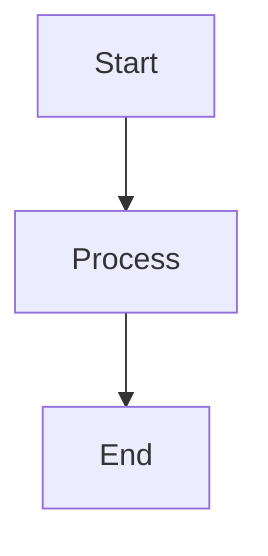

# Mermaid Diagram Setup for Aegle Documentation

This document explains how Mermaid diagrams are configured and used in the Aegle documentation.

## Configuration

The Mermaid support has been added to the Docusaurus configuration in `docusaurus.config.js`:

### 1. Theme Installation
```bash
npm install @docusaurus/theme-mermaid@3.7.0
```

### 2. Configuration Updates

```javascript
// docusaurus.config.js
export default {
  // ... other config
  
  themes: ['@docusaurus/theme-mermaid'],
  
  markdown: {
    mermaid: true,
  },

  themeConfig: {
    // ... other theme config
    mermaid: {
      theme: {light: 'neutral', dark: 'dark'},
    },
  },
};
```

## Usage in Markdown Files

To use Mermaid diagrams in your documentation, simply use the standard Mermaid code block syntax:

````markdown

````

## Pipeline Workflow Diagrams

The main pipeline workflow diagrams are located in:

- **Interactive Mermaid Version**: `docs/Main/pipeline-workflow.md`
- **Quick Overview**: `docs/Main/pipeline-overview.md`
- **Static Fallback**: `docs/Main/pipeline-overview-static.md`
- **Standalone Mermaid**: `static/diagrams/pipeline-workflow.mmd`

## Troubleshooting

### If Mermaid Diagrams Don't Render

1. **Check Browser Console**: Look for JavaScript errors
2. **Verify Configuration**: Ensure all config settings are correct
3. **Clear Cache**: Try clearing browser cache and rebuilding
4. **Use Static Version**: Fall back to `pipeline-overview-static.md`

### Common Issues

1. **Version Mismatch**: Ensure all Docusaurus packages have matching versions
2. **Syntax Errors**: Validate Mermaid syntax using online tools
3. **Theme Issues**: Check if the selected theme supports your diagram type

### Building and Testing

```bash
# Build the documentation
npm run build

# Start development server
npm run start

# Serve built documentation
npm run serve
```

## Mermaid Diagram Types Supported

- Flowcharts (`flowchart` or `graph`)
- Sequence diagrams (`sequenceDiagram`)
- Class diagrams (`classDiagram`)
- State diagrams (`stateDiagram`)
- Entity relationship diagrams (`erDiagram`)
- User journey diagrams (`journey`)
- Gantt charts (`gantt`)
- Pie charts (`pie`)
- Git graphs (`gitGraph`)

## Best Practices

1. **Keep diagrams simple**: Complex diagrams may not render well on mobile
2. **Use consistent styling**: Apply consistent colors and shapes
3. **Test on different devices**: Ensure diagrams are readable on all screen sizes
4. **Provide alternatives**: Consider static images for critical diagrams
5. **Validate syntax**: Use Mermaid live editor to test diagrams before committing

## Resources

- [Mermaid Documentation](https://mermaid-js.github.io/mermaid/)
- [Docusaurus Mermaid Plugin](https://docusaurus.io/docs/markdown-features/diagrams)
- [Mermaid Live Editor](https://mermaid.live/)
