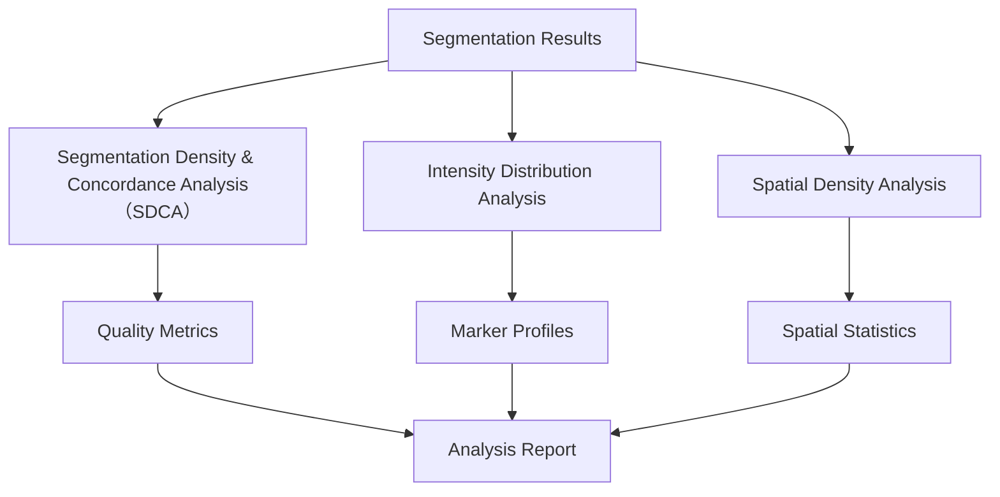

# Mask Analysis Details

This document describes the quality control (QC) metrics calculated by the mask analysis module to assess sample quality in PhenoCycler scans. More technical details beyond this document are written in Overleaf upon request.

## Overview

The segmentation analysis module (`aegle/segmentation_analysis/segmentation_analysis.py`) performs comprehensive quality assessment of cell and nucleus segmentation results. It analyzes both the original segmentation output and the repaired (matched) segmentation to evaluate improvements and identify potential issues.

The module performs three complementary types of analysis:


## Segmentation Density & Concordance Analysis (SDCA)
This module implements a set of metrics designed to quantify segmentation mask properties. SDCA provides both **global** and **local** density metrics from cell and nucleus masks, and evaluates the **concordance between cell and nucleus segmentation** before and after repair. Together, these measures serve as sample-level quality indicators and help characterize tissue organization and segmentation performance.

The global metrics are calculated for the entire patch. The local metrics are mean of the statistics calculated by a sliding window approach. By default, the window size is 200 µm.

> Recall that segmentation repair is introduced in [Segmentation Details](SegmentationDetails.md).

### Inputs

- `cell_mask`: Original cell mask  
- `nucleus_mask`: Original nucleus mask  
- `cell_matched_mask`: Repaired (matched) cell mask  
- `nucleus_matched_mask`: Repaired (matched) nucleus mask  
- `nucleus_unmatched_mask`: Nuclei present in original segmentation but not matched after repair  
- `image_mpp`: Microns per pixel (default = 0.5)  
- `window_size_microns`: Window size for local density calculation (default = 200 µm)  

### Outputs

SDCA produces a dictionary of metrics with three main sections for all five masks (cell_mask, nucleus_mask, cell_matched_mask, nucleus_matched_mask, nucleus_unmatched_mask):

- **Global Metrics (`metrics["global"]`)**  
  Per-mask statistics:  
  - `n_objects`: Number of segmented objects  
  - `area_mm2`: Effective tissue area (mm²)  
  - `density`: Objects per mm²  

- **Local Metrics (`metrics["local"]`)**  
  Sliding-window statistics:  
  - `mean`, `median`, `std`, `quantile_25`, `quantile_75`  

- **Local Density List (`metrics["local_density_list"]`)**  
  Raw per-window statistics in Local Metrics.

Example structure:

```json
{
  "global": {
    "cell": {"n_objects": 1500, "area_mm2": 0.85, "density": 1764.7},
    "nucleus": {...},
    "repaired_cell": {...},
    "repaired_nucleus": {...},
    "unmatched_nucleus": {...}
  },
  "local": {
    "cell": {"mean": 1650.4, "median": 1600.0, "std": 220.5, ...},
    "nucleus": {...},
    ...
  },
  "local_density_list": {...},
  "window_size_microns": 200
}
```

## Intensity Distribution Analysis

## Spatial Density Analysis

## Key Metrics

### 1. Matched Fraction
**Description**: The fraction of nuclei that have been successfully matched with corresponding cell boundaries.

**Calculation**: `matched_fraction = number_of_matched_nuclei / total_number_of_nuclei`

**Interpretation**: 
- Higher values (close to 1.0) indicate better segmentation quality
- Low values may indicate segmentation issues or tissue regions with poor cell boundary detection

### 2. Cell Density Metrics

#### 2.1 Global Density
**Description**: Overall cell density across the entire patch.

**Metrics calculated**:
- `cell_density`: Number of cells per mm²
- `nucleus_density`: Number of nuclei per mm²
- `matched_cell_density`: Number of matched cells per mm²
- `matched_nucleus_density`: Number of matched nuclei per mm²
- `unmatched_nucleus_density`: Number of unmatched nuclei per mm²

**Usage**: Helps identify tissue regions and assess overall cellularity.

#### 2.2 Local Density
**Description**: Cell density calculated at a local neighborhood level for each cell.

**Metrics calculated**:
- `local_cell_density`: Local density around each cell
- `local_nucleus_density`: Local density around each nucleus
- Distribution statistics (mean, std, percentiles)

**Usage**: Identifies spatial heterogeneity and clustering patterns.

### 3. Intensity Analysis

#### 3.1 Channel Intensity Bias
**Description**: Analyzes the intensity differences between original and repaired segmentation masks across all antibody channels.

**Purpose**: 
- Identifies systematic biases introduced by segmentation repair
- Detects channels that may be affected by segmentation artifacts

**Visualization**: Box plots comparing intensity distributions between:
- Original cell masks vs. matched cell masks
- Original nucleus masks vs. matched nucleus masks
- Unmatched nuclei (nuclei without corresponding cells)

#### 3.2 Intensity Distribution Analysis
**Description**: Comprehensive visualization of intensity distributions for each antibody channel.

**Features**:
- Log-scale histograms for better visualization of wide dynamic ranges
- Separate distributions for different mask types
- Channel-by-channel comparison

## Configuration

The segmentation analysis can be configured in the main configuration file:

```yaml
segmentation:
  segmentation_analysis: True  # Enable/disable the entire analysis
  density_analysis:
    calculate_global_density: True  # Calculate patch-level density
    calculate_local_density: True   # Calculate cell-level local density
  channels_per_figure: 10  # Number of channels per visualization figure
```

## Output Files

### 1. Patch-level Outputs
Each informative patch generates its own subdirectory containing:
- `cell_density_visualization/`: Density distribution plots
- `channel_intensity_repair_bias/`: Bias analysis visualizations
- `channel_intensity_distributions_plots/`: Intensity distribution plots

### 2. Dataset-level Outputs
- `codex_patches_segmentation_analysis.pickle`: Complete analysis results
- `patches_metadata.csv`: Updated with all calculated metrics

## Interpretation Guidelines

### Red Flags in QC Metrics
1. **Very low matched fraction** (< 0.5): Indicates poor segmentation quality
2. **Extreme density values**: May indicate tissue artifacts or segmentation errors
3. **Large intensity biases**: Suggests the repair process is altering biological signals
4. **Bimodal density distributions**: May indicate distinct tissue regions requiring separate analysis

### Best Practices
1. Review metrics for outlier patches
2. Compare metrics across different tissue types
3. Use intensity bias analysis to validate marker expression patterns
4. Consider local density patterns when analyzing spatial relationships

## Technical Details

### Parallel Processing
The analysis uses multiprocessing to handle large datasets efficiently:
- Configurable number of workers (default: 4)
- Each patch is processed independently
- Results are aggregated after all patches complete

### Memory Considerations
- Large datasets may require memory management strategies
- Consider processing in batches for very large experiments
- Intensity data is stored per-patch to manage memory usage
