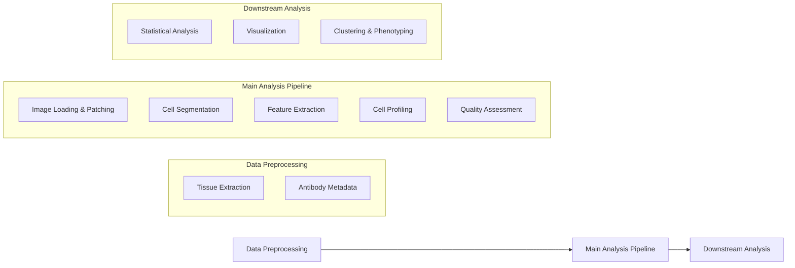

# Overview

*Last updated: December 2024*

The Main pipeline module represents the core analytical engine of the Aegle system, responsible for transforming preprocessed multiplex imaging data into quantified single-cell profiles and comprehensive tissue analysis results.

## Pipeline Architecture

*Pipeline architecture diagram will be added here*

## Workflow Integration

The Main pipeline operates as the central component in a three-stage analytical workflow:



## Core Functionality

### 1. Image Processing & Patching
- **Full Image Processing**: Loads and processes complete CODEX/PhenoCycler images
- **Intelligent Patching**: Divides images into overlapping patches for scalable analysis
- **Channel Extraction**: Selects biologically relevant channels (membrane, nucleus markers)
- **Quality Filtering**: Identifies and filters empty or noisy patches

### 2. Cell Segmentation
- **Multi-channel Segmentation**: Simultaneous nucleus and cell boundary detection
- **Advanced Algorithms**: Integration of state-of-the-art segmentation methods
- **Cell-Nucleus Matching**: Sophisticated algorithms to match cells with their nuclei
- **Mask Repair**: Post-processing to improve segmentation quality

### 3. Single-Cell Profiling
- **Intensity Quantification**: Measures marker expression levels per cell
- **Morphological Analysis**: Extracts cell shape and size characteristics
- **Spatial Context**: Records cell positions and neighborhood relationships
- **Quality Metrics**: Calculates reliability scores for each measurement

### 4. Comprehensive Analysis
- **Segmentation Evaluation**: Detailed assessment of segmentation quality
- **Intensity Distribution Analysis**: Statistical characterization of marker expression
- **Spatial Density Metrics**: Quantification of cell distribution patterns
- **Batch Processing**: Efficient handling of multiple experiments

## Key Features

### Scalability & Performance
- **Patch-based Processing**: Handles large images by processing manageable patches
- **Parallel Execution**: Multi-core processing for improved performance
- **Memory Management**: Efficient memory usage for large datasets
- **Batch Processing**: Automated processing of multiple experiments

### Quality Control
- **Automated QC**: Built-in quality assessment at multiple stages
- **Visualization Tools**: Comprehensive visualization of results and intermediate steps
- **Logging & Monitoring**: Detailed logging for debugging and performance tracking
- **Reproducibility**: Complete parameter tracking and result versioning

### Flexibility & Customization
- **Configurable Parameters**: Extensive configuration system for different use cases
- **Modular Design**: Individual components can be run independently
- **Multiple Output Formats**: Results available in various formats (CSV, pickle, images)
- **Integration Ready**: Designed to work seamlessly with upstream and downstream modules

## Main Entry Points

The Main pipeline can be executed through several entry points:

### 1. Individual Experiment Execution
```bash
# Run single experiment
python src/main.py \
  --data_dir /path/to/data \
  --config_file /path/to/config.yaml \
  --out_dir /path/to/output \
  --log_level INFO
```

### 2. Batch Processing
```bash
# Process multiple experiments
./run_main_ft.sh
```

### 3. Analysis Pipeline
```bash
# Run downstream analysis
./run_analysis_ft.sh
```

## Configuration Integration

The Main pipeline integrates seamlessly with the [Experiment Configuration](../ExperimentConfiguration/intro.md) system:

- **Template-based Configuration**: Uses `main_template.yaml` for consistent parameter management
- **CSV-driven Experiments**: Experiment designs from Google Sheets drive batch processing
- **Automated Config Generation**: Configurations generated automatically from design tables
- **Parameter Validation**: Built-in validation ensures configuration consistency

## Output Structure

The pipeline generates comprehensive outputs organized in a structured format:

```
output_directory/
├── cell_profiling/              # Single-cell data
│   ├── patch-0-cell_by_marker.csv
│   └── patch-0-cell_metadata.csv
├── extracted_channel_patches.npy   # Processed image patches
├── original_seg_res_batch.pickle   # Raw segmentation results
├── matched_seg_res_batch.pickle    # Processed segmentation results
├── patches_metadata.csv            # Patch-level metadata
├── channel_stats.csv              # Channel statistics
└── copied_config.yaml             # Configuration record
```

## Performance Considerations

### Memory Management
- **Patch Size Optimization**: Balance between processing efficiency and memory usage
- **Channel Selection**: Process only necessary channels to reduce memory footprint
- **Batch Size Control**: Configurable batch sizes for different hardware configurations

### Processing Speed
- **Parallel Processing**: Multi-core utilization for CPU-intensive operations
- **Efficient Algorithms**: Optimized implementations for segmentation and feature extraction
- **Smart Caching**: Intermediate result caching to avoid redundant computations

### Storage Requirements
- **Compressed Outputs**: Efficient storage formats to minimize disk usage
- **Selective Output**: Configurable output generation to save only necessary results
- **Cleanup Options**: Automatic cleanup of intermediate files

## Integration with Other Modules

### Upstream Integration (DataPreprocess)
- Seamlessly processes outputs from the [Data Preprocessing](../DataPreprocess/Overview.md) module
- Automatically locates preprocessed tissue regions and antibody metadata
- Validates input data quality and format compatibility

### Downstream Integration (Analysis)
- Outputs formatted for immediate use by downstream analysis modules
- Standardized file formats ensure compatibility
- Metadata preservation enables full traceability

## Next Steps

To get started with the Main pipeline:

1. **Review Configuration**: Understand the [configuration parameters](Configuration.md)
2. **Check Prerequisites**: Ensure [Data Preprocessing](../DataPreprocess/Overview.md) is complete
3. **Run Pipeline**: Follow the [execution guide](Execution.md) for your use case
4. **Analyze Results**: Examine [outputs](Outputs.md) and proceed to downstream analysis

For detailed information about specific components, see:
- [Preprocessing Details](Preprocess.md)
- [Segmentation Analysis](SegmentationAnalysis.md)
- [Configuration Reference](Configuration.md)
- [Execution Guide](Execution.md)
- [Troubleshooting](Troubleshooting.md)
