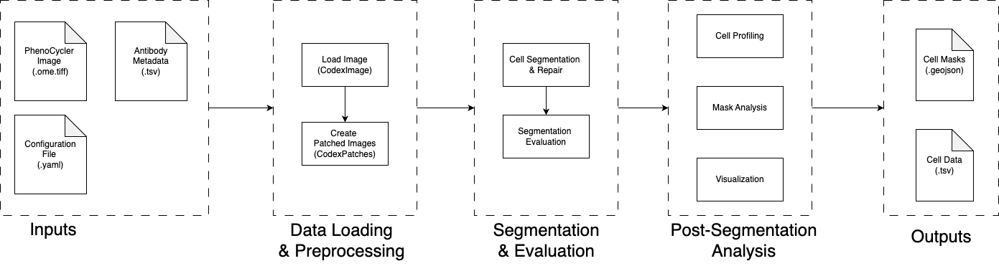

# Overview

This document provides detailed information about the core components of the Main analysis pipeline. The pipeline transforms raw multiplex imaging data into quantified single-cell profiles through a series of carefully orchestrated processing stages.

## Pipeline Architecture

The Main pipeline consists of two primary processing phases that work together to extract meaningful biological information from large-scale multiplex imaging data:



## Output Structure

The pipeline generates comprehensive outputs organized in a structured format:

```
output_directory/
├── cell_profiling/              # Single-cell data
│   ├── patch-0-cell_by_marker.csv
│   └── patch-0-cell_metadata.csv
├── extracted_channel_patches.npy   # Processed image patches
├── original_seg_res_batch.pickle   # Raw segmentation results
├── matched_seg_res_batch.pickle    # Processed segmentation results
├── patches_metadata.csv            # Patch-level metadata
├── channel_stats.csv              # Channel statistics
└── copied_config.yaml             # Configuration record
└── seg_evaluation_metrics.pkl     # Segmentation evaluation results
```
## Data Loading and Preprocessing
Before segmentation, the pipeline loads the image and the antibodies data and prepare objects for further processing.

### Load Image and Antibodies Data

This initial phase loads the multiplex image and the antibodies data into the `CodexImage` object. 

Then Calculate channel-level statistics (Min, Median, Max, 95%, Mean, Std Dev) and save them to a file `channel_stats.csv`.

Next, extract the target channels from the image based on the configuration. If more than one wholecell channel is specified, they will be merged into a single channel by taking the maximum intensity projection. The extracted channels are stacked along the third dimension in the order of (nucleus, wholecell) and assigned to the `extracted_channel_image` attribute of the `CodexImage` object.

### Patch-Based Processing

Ideally, we just use `patching::split_mode` as `full_image` and consider the image as a single patch for segmentation. However, sometimes the image is too large to be processed in a single patch, we can use `patching::split_mode` as `halves` or `quarters` to divide the image into manageable patches. I had situation that after spliting, the image is still too large to fit into memory. So we implemented a disk-based patches strategy to handle large images. See `_extract_patches_from_coordinates` in `codex_patches.py`. But we should implment more unit test to make sure the disk-based patches strategy is working as expected.

On the other hand, we would like to do segmentation on small patches for other purposes, such as patch-level analysis. We can use `patching::split_mode` as `patches` to divide the image into small patches. The `patching::patch_height` and `patching::patch_width` are the height and width of each patch, and the `patching::overlap` is the overlap fraction between adjacent patches. We have a [web app](https://github.com/kimpenn/aegle_patch_viewer) to visualize the patches with the overlap to have intuition about the patches. Two have patches in same shape, we have two steps:(1) extend the image for full patch coverage and (2) generate the patches on the extended image. The patches are saved in the `CodexPatches` object as `extracted_channel_patches` and `all_channel_patches` attributes. 

The metadata of patches are calculated, including patch_id, height, width, nucleus_mean, nucleus_std, nucleus_non_zero_perc, wholecell_mean, wholecell_std, wholecell_non_zero_perc. Config has `patch_qc` section to control the quality control, including 
- `non_zero_perc_threshold`: Minimum fraction of non-zero pixels required for a patch to be considered valid
- `mean_intensity_threshold`: Minimum mean intensity for the patch to be considered informative
- `std_intensity_threshold`: Minimum standard deviation required to avoid marking patches as too "flat"
Currently the first two are used. A patch is considered empty if the `nucleus_non_zero_perc` is less than `non_zero_perc_threshold` and considered noisy if the `nucleus_mean` is less than `mean_intensity_threshold` and it is set as `is_empty` and `is_noisy` in `patches_metadata`. Either of them is true, the patch is marked as bad and set as `is_bad_patch` in `patches_metadata`. The patches are marked as informative if they are not bad. Details see `qc_patch_metadata` in `codex_patches.py`. It helps to filter out the patches which are background, artifacts, or just a small part of the tissue. We will only run segmentation on the informative patches.

The matadata is saved as `patches_metadata` attribute of the `CodexPatches` object and saved in the `patches_metadata.csv` file.

### Optional Patch Perturbations

To test the robustness of downstream segmentation models, we implment this module to add controlled perturbations to the patches. So that we can benchmarking the segmentation models on different types of data disruptions. It should not be used in the production environment.

- If `testing::data_disruption::type` is None, no perturbations will be added.
- If `testing::data_disruption::type` is `gaussian`, we will add Gaussian noise to the patches. The noise level is controlled by `testing::data_disruption::level`. The noise level is a number between 1 and 5. 1 is the minimal noise level and 5 is the maximal noise level.
- If `testing::data_disruption::type` is `downsampling`, we will downsample the patches. The downsampling level is controlled by `testing::data_disruption::level`. The downsampling level is a number between 1 and 3. 1 is the minimal downsampling level and 3 is the maximal downsampling level.

We can use `testing::data_disruption` section to control the perturbations. Details see `add_disruptions` in `codex_patches.py`.

TODO: It might be better to isolate this module from the main pipeline. So that we can use it in the production environment. But we need to make more changes and divide the pipeline into more components such that the output from perturbation module can be integrated into the main pipeline.

### Optional Patch Visualizations
We generate the visualizations of the patches to help the user to check the quality of the patches and the perturbations.

Notes: Given `visualization::visualize_patches` is True, if `testing::data_disruption::visualize_disrupted` is True, the visualizations will be the disrupted patches. Otherwise, the visualizations will be the original patches.

**Visualization Configuration**:
```yaml
testing:
  data_disruption:
    # Disruption type can be "downsampling" or "gaussian"
    type: gaussian
    # Intensity level of disruption (1-5, for instance)
    level: 3
    # Whether to save the disrupted patches to disk (for debugging/testing)
    save_disrupted_patches: True
    # Whether to visualize the disrupted patches
    visualize_disrupted: False
```

**Outputs**:
- `patches_visualizations/good_patches/patch-{i}.png`
- `patches_visualizations/bad_patches/patch-{i}.png`

## Segmentation and Evaluation

This stage covers both **segmentation** and **automated quality assessment**.  

### Cell Segmentation

This phase performs cell and nucleus segmentation on the informative patches using the DeepCell Mesmer model. The segmentation process identifies individual cells and their corresponding nuclei, enabling downstream single-cell analysis. The `run_cell_segmentation` function in `segment.py` orchestrates the entire segmentation process:

1. **Patch Selection**: Only processes patches marked as informative (not empty or noisy) from Phase B
2. **Model Loading**: Loads the pre-trained DeepCell Mesmer model for multiplex segmentation
3. **Segmentation Processing**: Applies the model to extract cell and nucleus masks
4. **Mask Repair**: Matches cells to nuclei and repairs segmentation artifacts
5. **Result Storage**: Saves segmentation masks and metadata

More details see [Segmentation Details](SegmentationDetails.md).

**Segmentation Configuration**:
```yaml
segmentation:
  # Path to the DeepCell Mesmer model
  model_path: /path/to/MultiplexSegmentation
  # Save segmentation masks as image files
  save_segmentation_images: true
  # Save complete segmentation results as pickle
  save_segmentation_pickle: true
```

**Outputs**
- Segmentation Masks (per patch):
  - `cell_matched_mask`: Matched cell segmentation masks
  - `nucleus_matched_mask`: Matched nucleus segmentation masks  
  - `cell_outside_nucleus_mask`: Cell regions outside nucleus boundaries
- Metadata:
  - `patches_metadata.csv`: Updated with `matched_fraction` for each patch
  - Segmentation quality statistics and matching metrics
- Optional Outputs:
  - Segmentation mask images (if `save_segmentation_images: true`)
  - Complete `CodexPatches` pickle file (if `save_segmentation_pickle: true`)

### Segmentation Evaluation

This step is the automated segmentation quality assessment using the `run_seg_evaluation` function implemented in `evaluation.py`. This evaluation system provides comprehensive metrics to assess the quality of cell segmentation results. The evaluation process follows these key steps:

1. **Patch Filtering**: Only evaluates informative patches (marked as `is_informative` in metadata)
2. **Cell Count Validation**: Skips patches with fewer than 20 cells to ensure statistical reliability
3. **Parallel Processing**: Uses 2 worker processes for efficient evaluation across multiple patches
4. **Comprehensive Metrics**: Calculates 14 different quality metrics for each patch
5. **Quality Score Generation**: Combines metrics into a single quality score using PCA-based model

More details see [Evaluation Details](EvaluationDetails.md).

**Evaluation Configuration**:
```yaml
evaluation:
  compute_metrics: false
```

**Outputs**

The evaluation results are stored in `codex_patches.seg_evaluation_metrics` as a list of dictionaries, where each dictionary contains and saved in the `seg_evaluation_metrics.pkl` file.

## Post-Segmentation Analysis

### Cell Profiling

### QC Metrics

### Visualizations