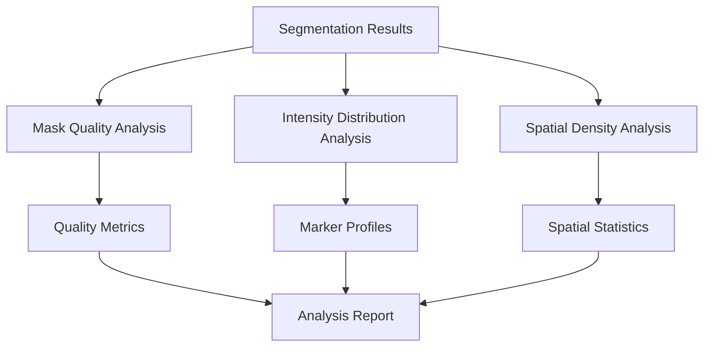
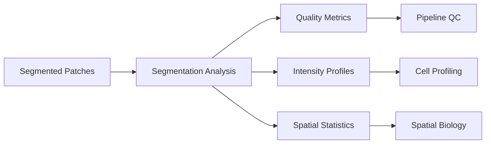

# Segmentation Analysis

This document provides comprehensive information about the segmentation analysis module, which performs detailed evaluation of cell and nucleus segmentation quality, quantifies marker intensity distributions, and analyzes spatial organization patterns in multiplex imaging data.

## Analysis Framework

The segmentation analysis module operates as an optional but highly recommended component that provides critical quality assessment and biological insights. It can be enabled through configuration and generates comprehensive reports on segmentation performance.

### When to Use Segmentation Analysis

**Enable for**:
- Quality control assessments
- Method comparison studies
- Publication-quality results
- Troubleshooting segmentation issues
- Spatial biology research

**Disable for**:
- High-throughput screening (speed priority)
- Limited storage scenarios
- Preliminary exploratory analysis

### Analysis Architecture

The module performs three complementary types of analysis:



## Core Analysis Components

### 1. Mask Quality Analysis

**Purpose**: Evaluate the effectiveness of cell-nucleus matching and overall segmentation quality

**Mask Types Analyzed**:
- **Original Cell Mask**: Raw cell segmentation from deep learning model
- **Original Nucleus Mask**: Raw nucleus segmentation from deep learning model  
- **Matched Cell Mask**: Cells successfully paired with nuclei
- **Matched Nucleus Mask**: Nuclei successfully paired with cells
- **Unmatched Nucleus Mask**: Nuclei without corresponding cell boundaries
- **Cell-Outside-Nucleus Mask**: Cytoplasmic regions (cell minus nucleus)

**Quality Metrics**:
- **Matching Efficiency**: Percentage of nuclei successfully matched to cells
- **Object Count Comparison**: Cell vs nucleus counts across mask types
- **Area Distribution**: Size distributions for different object types
- **Shape Analysis**: Morphological characteristics of matched vs unmatched objects

**Configuration**:
```yaml
segmentation:
  segmentation_analysis: true  # Enable comprehensive analysis
  save_segmentation_images: true  # Save mask visualizations
```

### 2. Intensity Distribution Analysis

**Purpose**: Characterize marker expression patterns across different cellular compartments

**Analysis Scope**:
- **Per-Marker Analysis**: Individual analysis for each antibody channel
- **Per-Compartment Analysis**: Nuclear vs cytoplasmic vs whole-cell intensities
- **Comparative Analysis**: Matched vs unmatched object comparisons
- **Statistical Characterization**: Distribution parameters and outlier detection

**Intensity Metrics**:
- **Mean Intensity**: Average marker expression per object
- **Median Intensity**: Robust central tendency measure
- **Intensity Variance**: Measure of expression heterogeneity
- **Percentile Ranges**: 25th, 75th, 90th, 95th percentiles
- **Coefficient of Variation**: Normalized intensity variability

**Bias Assessment**:
- **Matching Bias**: Comparison of intensity distributions before/after matching
- **Compartment Bias**: Nuclear vs cytoplasmic expression differences
- **Size Bias**: Intensity correlation with object size

**Visualization Outputs**:
- Intensity distribution histograms per marker
- Box plots comparing mask types
- Scatter plots showing intensity correlations
- Heatmaps of marker co-expression patterns

### 3. Spatial Density Analysis

**Purpose**: Quantify spatial organization and cell density patterns

**Density Metrics**:
- **Global Density**: Overall cells per unit area (cells/mm²)
- **Local Density**: Density in sliding windows across the tissue
- **Density Gradients**: Spatial variation in cell density
- **Clustering Analysis**: Identification of high/low density regions

**Spatial Scales**:
- **Patch-Level**: Density within individual image patches
- **Local Windows**: Moving window analysis (configurable size)
- **Tissue-Level**: Overall tissue architecture characterization

**Analysis Parameters**:
```yaml
# Spatial analysis configuration (advanced)
spatial_analysis:
  window_size: 500  # pixels for local density calculation
  step_size: 250    # overlap between windows
  min_objects: 10   # minimum objects for reliable density estimate
```

## Execution and Configuration

### Enabling Segmentation Analysis

The analysis is controlled through the main configuration file:

```yaml
segmentation:
  segmentation_analysis: true  # Enable comprehensive analysis
  save_segmentation_images: true  # Save visualization outputs
  model_path: /path/to/segmentation/model
```

### Programmatic Usage

```python
from aegle.segmentation_analysis.segmentation_analysis import run_segmentation_analysis

# Run analysis on processed patches
run_segmentation_analysis(codex_patches, config, args)
```

### Integration with Main Pipeline

The analysis runs automatically after segmentation when enabled:

1. **Segmentation Completion**: Cell and nucleus masks generated
2. **Cell-Nucleus Matching**: Objects paired across mask types  
3. **Analysis Trigger**: Segmentation analysis begins if configured
4. **Result Generation**: Comprehensive analysis outputs created

## Input Data Requirements

### Required Objects

- **`codex_patches`**: Main patches object containing:
  - `original_seg_res_batch`: Raw segmentation masks per patch
  - `matched_seg_res_batch`: Post-processed masks with matching results
  - `extracted_channel_patches`: Image data for all channels
  - `patches_metadata`: Patch-level quality and spatial information

### Configuration Parameters

- **Image Resolution**: `data.image_mpp` for spatial calculations
- **Analysis Scope**: Which analyses to perform
- **Visualization Settings**: Output generation preferences
- **Performance Settings**: Memory and processing optimization

### Data Quality Requirements

- **Minimum Object Count**: At least 10 objects per patch for reliable statistics
- **Channel Quality**: Sufficient signal-to-noise ratio in analyzed channels
- **Segmentation Quality**: Reasonable segmentation success rate (&gt;50% matching)

## Comprehensive Output Suite

### Primary Analysis Files

#### `codex_patches_segmentation_analysis.pickle`
- **Content**: Complete analysis results in serialized format
- **Size**: 10-100MB depending on patch count and marker number
- **Usage**: Loading results for further analysis or visualization
- **Structure**: Dictionary with analysis results per patch and summary statistics

#### Updated Metadata Files
- **`patches_metadata.csv`**: Enhanced with density metrics
- **Additional Columns**: 
  - `cell_density_per_mm2`: Global cell density
  - `nucleus_density_per_mm2`: Global nucleus density
  - `matching_efficiency`: Fraction of nuclei successfully matched
  - `mean_cell_area`: Average cell size in pixels

### Visualization Outputs

#### Channel Intensity Analysis
- **`intensity_distributions/`**: Directory containing per-channel analysis
  - `{marker}_intensity_distribution.png`: Histogram comparisons
  - `{marker}_compartment_comparison.png`: Nuclear vs cytoplasmic
  - `{marker}_bias_analysis.png`: Matching bias assessment

#### Spatial Density Analysis  
- **`density_analysis/`**: Spatial organization visualizations
  - `cell_density_histogram.png`: Distribution of local densities
  - `density_heatmap.png`: Spatial density map
  - `density_gradient_analysis.png`: Directional density patterns

#### Segmentation Quality Assessment
- **`segmentation_quality/`**: Quality control visualizations
  - `matching_efficiency_summary.png`: Overall matching statistics
  - `object_size_distributions.png`: Size comparison across mask types
  - `segmentation_overlay_samples.png`: Example segmentation results

### Statistical Summary Files

#### `intensity_bias_summary.csv`
Quantitative comparison of intensity distributions:

| Column | Description | Example |
|--------|-------------|---------|
| `marker` | Antibody/channel name | "CD3", "DAPI" |
| `original_mean` | Mean intensity in original masks | 145.67 |
| `matched_mean` | Mean intensity in matched masks | 142.34 |
| `bias_ratio` | Ratio of matched/original means | 0.978 |
| `p_value` | Statistical significance of difference | 0.023 |

#### `density_summary.csv`
Spatial density metrics per patch:

| Column | Description | Units |
|--------|-------------|-------|
| `patch_id` | Patch identifier | Integer |
| `cell_density` | Cells per unit area | cells/mm² |
| `nucleus_density` | Nuclei per unit area | nuclei/mm² |
| `local_density_cv` | Coefficient of variation in local density | Unitless |
| `clustering_index` | Measure of spatial clustering | 0-1 scale |

## Performance Optimization

### Computational Considerations

The segmentation analysis involves intensive computations across large datasets:

**Memory Usage**:
- **Intensity Analysis**: Processes all channel data simultaneously
- **Spatial Analysis**: Requires patch-level coordinate calculations
- **Visualization**: Generates multiple high-resolution plots

**Processing Time**:
- **Small Datasets** (&lt;1000 cells/patch): 1-5 minutes per patch
- **Medium Datasets** (1000-5000 cells/patch): 5-15 minutes per patch  
- **Large Datasets** (&gt;5000 cells/patch): 15-60 minutes per patch

### Optimization Strategies

#### Memory Management
```yaml
# Reduce memory usage
segmentation:
  segmentation_analysis: true
  save_segmentation_images: false  # Skip image outputs
  
# Process fewer channels simultaneously
analysis_scope:
  max_channels_parallel: 5  # Limit concurrent channel processing
```

#### Processing Speed
```python
# Parallel processing configuration
import multiprocessing
n_cores = min(4, multiprocessing.cpu_count())  # Limit core usage

# Memory-conscious processing
process_batch_size = 100  # Objects per batch
```

#### Storage Optimization
```bash
# Compress large output files
gzip codex_patches_segmentation_analysis.pickle

# Remove intermediate visualization files
find . -name "*_intermediate.png" -delete
```

### Troubleshooting Performance Issues

#### Memory Errors
```python
# Symptoms: MemoryError, process killed
# Solutions:
# 1. Process fewer patches simultaneously
# 2. Reduce visualization output
# 3. Increase system swap space
```

#### Slow Processing
```python
# Symptoms: Analysis takes &gt;1 hour per patch
# Solutions:
# 1. Reduce number of channels analyzed
# 2. Skip spatial density analysis for large patches
# 3. Use sampling for very large cell populations
```

## Integration with Pipeline Workflow

### Upstream Dependencies

The segmentation analysis requires successful completion of:

1. **Image Processing**: Channel extraction and patch generation
2. **Segmentation**: Cell and nucleus mask creation
3. **Cell-Nucleus Matching**: Object pairing across mask types

### Downstream Applications

Analysis outputs enable:

1. **Quality Assessment**: Segmentation pipeline validation
2. **Method Comparison**: Benchmarking different segmentation approaches
3. **Biological Discovery**: Spatial organization insights
4. **Publication Preparation**: High-quality figures and statistics

### Data Flow Integration



## Analysis Examples and Use Cases

### Quality Control Assessment

```python
# Load analysis results
import pickle
with open('codex_patches_segmentation_analysis.pickle', 'rb') as f:
    analysis_results = pickle.load(f)

# Check overall segmentation quality
matching_efficiency = analysis_results['summary']['matching_efficiency']
print(f"Cell-nucleus matching: {matching_efficiency:.1%}")

# Identify problematic patches
poor_patches = [p for p in analysis_results['patches'] 
               if p['matching_efficiency'] < 0.5]
print(f"Patches needing attention: {len(poor_patches)}")
```

### Marker Expression Analysis

```python
# Analyze intensity bias
import pandas as pd
bias_data = pd.read_csv('intensity_bias_summary.csv')

# Find markers with significant bias
biased_markers = bias_data[bias_data['p_value'] < 0.05]
print("Markers with matching bias:")
print(biased_markers[['marker', 'bias_ratio', 'p_value']])
```

### Spatial Organization Study

```python
# Load density data
density_data = pd.read_csv('density_summary.csv')

# Analyze spatial heterogeneity
mean_density = density_data['cell_density'].mean()
density_cv = density_data['cell_density'].std() / mean_density

print(f"Average cell density: {mean_density:.0f} cells/mm²")
print(f"Spatial heterogeneity: {density_cv:.2f}")
```

## Best Practices

### When to Enable Full Analysis

**Always Enable For**:
- Publication-quality studies
- Method development and validation
- Troubleshooting segmentation issues
- Spatial biology research

**Consider Disabling For**:
- High-throughput screening
- Preliminary exploratory analysis
- Resource-constrained environments

### Configuration Recommendations

#### Standard Analysis
```yaml
segmentation:
  segmentation_analysis: true
  save_segmentation_images: true
```

#### Resource-Constrained Analysis  
```yaml
segmentation:
  segmentation_analysis: true
  save_segmentation_images: false  # Skip visualizations
```

#### Comprehensive Research Analysis
```yaml
segmentation:
  segmentation_analysis: true
  save_segmentation_images: true
  
# Enable additional spatial analysis
spatial_analysis:
  enable_clustering_analysis: true
  enable_gradient_analysis: true
```

### Result Interpretation Guidelines

1. **Matching Efficiency**: &gt;70% indicates good segmentation quality
2. **Intensity Bias**: Bias ratio 0.9-1.1 suggests minimal matching artifacts  
3. **Spatial Density**: CV &lt;0.5 indicates relatively uniform cell distribution
4. **Object Counts**: Cell count ~90% of nucleus count expected for healthy tissue

The segmentation analysis module provides essential quality control and biological insights that enhance the reliability and interpretability of multiplex imaging analysis results.

