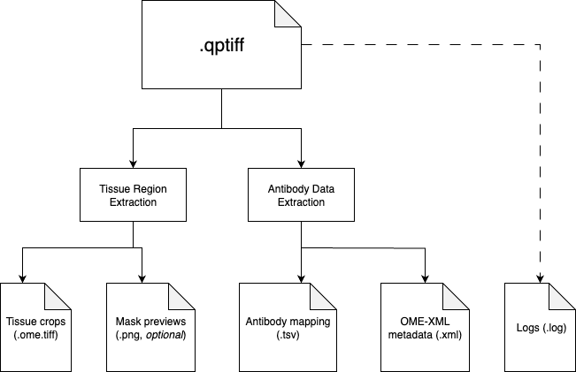

# Sample Preprocessing Overview

*Last updated: September 2024 - Deployment test successful*

This module handles the essential preprocessing steps for multiplex imaging data (PhenoCycler/CODEX) before downstream analysis. It can be executed by modifying and running the main shell script:

```bash
/workspaces/codex-analysis/0-phenocycler-penntmc-pipeline/run_preprocess_ft.sh
```

## Processing Pipeline Architecture



The preprocessing pipeline consists of two sequential steps:

### 1. Tissue Region Extraction

```bash
/workspaces/codex-analysis/0-phenocycler-penntmc-pipeline/src/extract_tissue_regions.py
```

This script identifies and extracts regions of interest from the raw imaging data using the following techniques:
- Downsampling of the original image (configurable via `downscale_factor`)
- Sobel edge detection and watershed segmentation with Otsu thresholding
- Connected component labeling and filtering by minimum area
- Extraction of the largest tissue regions (configurable via `n_tissue`)

Each detected tissue region is then cropped from the original high-resolution image and saved as a separate OME-TIFF file.

### 2. Antibody Data Extraction

```bash
/workspaces/codex-analysis/0-phenocycler-penntmc-pipeline/src/extract_antibodies.py
```

This script processes the QPTIFF metadata to extract antibody/channel information:
- Extracts the OME-XML metadata from the QPTIFF using Bio-Formats' `showinf` tool
- Parses the XML to identify channel IDs and antibody names
- Creates a standardized TSV file mapping channel IDs to antibody names

## Configuration Parameters

The pipeline uses YAML configuration files located at:
```
/workspaces/codex-analysis/0-phenocycler-penntmc-pipeline/exps/configs/{EXP_SET_NAME}/{EXP_ID}/config.yaml
```

Key configuration parameters include:
- `data.file_name`: Path to the input QPTIFF file
- `tissue_extraction.n_tissue`: Number of tissue regions to extract (default: 4)
- `tissue_extraction.downscale_factor`: Factor to downsample the image for initial detection (default: 64)
- `tissue_extraction.min_area`: Minimum area for a valid tissue region (default: 500)
- `tissue_extraction.visualize`: Whether to generate visualization of detected regions (default: false)
- `tissue_extraction.skip_roi_crop`: If true, skips ROI detection and saves the full image (default: false)

## Execution Workflow

1. The main script (`run_preprocess_ft.sh`) defines experiment set name, data directories, and experiment IDs
2. For each experiment ID:
   - Calls `run_extract_tissue.sh` to identify and extract tissue regions
   - Then calls `run_extract_antibody.sh` to extract antibody marker information
   - All output and errors are logged to `{LOG_DIR}/{EXP_ID}.log`

## Command Arguments

Both extraction scripts accept similar arguments:
- `--config`: Path to the YAML config file
- `--data_dir`: Directory containing the input data (default: "/workspaces/codex-analysis/data")
- `--out_dir`: Output directory for processed files
