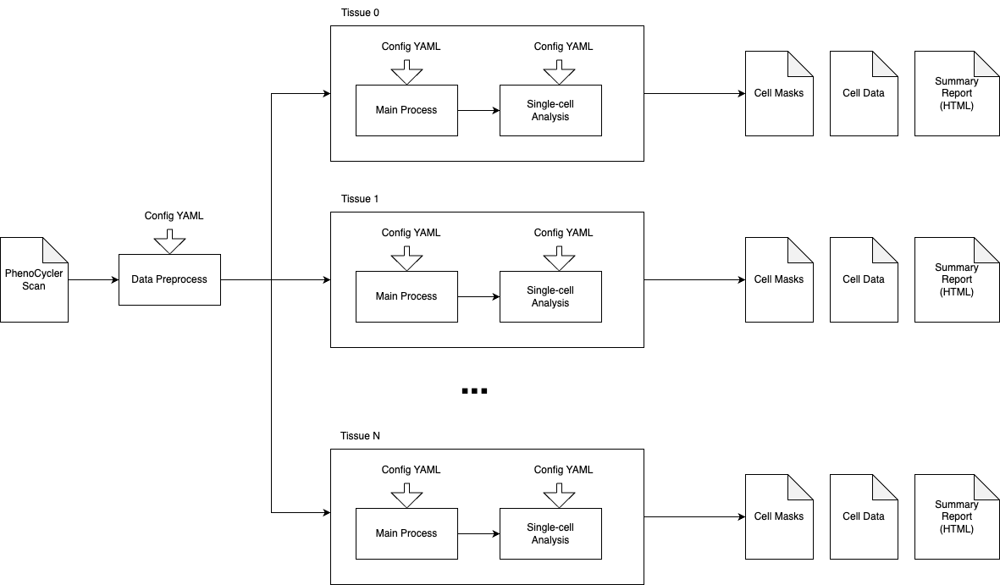

# Overview

## Data Preprocess
This module handles the essential preprocessing steps for multiplex imaging data (PhenoCycler/CODEX) before downstream analysis.

## Main

### Preprocess

### Segmentation

### Cell Profiling

## Analysis

## Experiment Configuration

The Aegle pipeline includes a comprehensive experiment configuration system that enables researchers to efficiently manage multiple experiments through automated configuration generation. This system uses CSV-based design tables and YAML templates to generate consistent, reproducible experiment configurations across the entire pipeline.

Key features include:
- Batch configuration generation from design tables
- Automatic parameter type conversion and validation
- Support for nested configuration structures
- Integration with all pipeline components (preprocessing, main analysis, and downstream analysis)

## Post-Analysis Visualization

Launch napari to interactively check mask the segmentation channels.