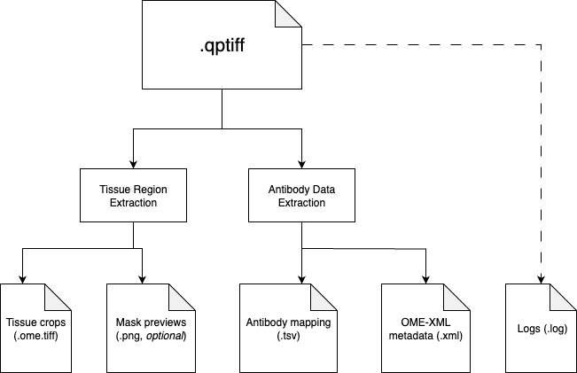
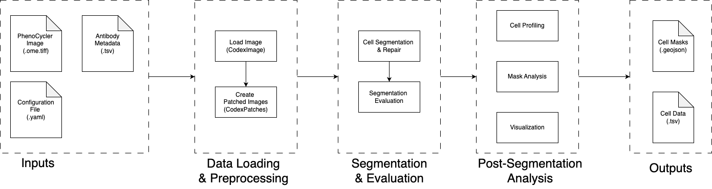

# Overview

Aegle is a comprehensive pipeline for analyzing multiplex imaging data from PhenoCycler/CODEX platforms, providing end-to-end processing from raw images to single-cell insights.

## Pipeline Architecture


For detailed documentation, see the specific sections in the sidebar.

## Experiment Configuration


The configuration system automates experiment setup through:
- **CSV Design Tables**: Define experiments in Google Sheets and export to CSV
- **YAML Templates**: Standardized parameter templates for reproducibility
- **Batch Generation**: Generate configurations for multiple experiments simultaneously
- **Validation**: Automatic type conversion and parameter validation

**Quick Start:**
```bash
cd exps/
python config_generator.py
```

## Data Preprocessing



Preprocessing transforms raw QPTIFF files into analysis-ready data:

**1. Tissue Extraction**
- Manual annotation (recommended): Interactive napari-based tool
- Automatic detection: Computer vision-based tissue identification

**2. Antibody Metadata**
- Extracts channel-to-antibody mappings from QPTIFF metadata
- Generates standardized TSV files for downstream analysis

**Execution:**
```bash
./launcher/run_preprocess_ft.sh
```

## Main Processing



## Single-cell Analysis

## Post-Analysis Visualization
